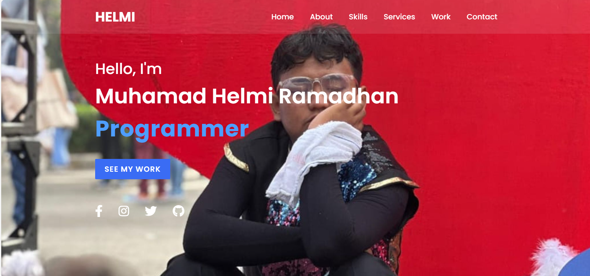

# 🌐 Portfolio Website - Muhamad Helmi Ramadhan

Ini adalah website portofolio sederhana yang dibuat menggunakan **HTML** dan **CSS**, ditujukan untuk menampilkan informasi pribadi, skill, layanan, dan karya-karya dari **Muhamad Helmi Ramadhan**.

Website ini cocok sebagai latihan bagi pemula untuk memahami struktur dasar HTML, pengaturan tampilan dengan CSS, serta penggunaan animasi sederhana.

---

## 📸 Tampilan Halaman Utama

---

## 📄 Struktur File

- `index.html` – Berisi struktur halaman web.
- `style.css` – Berisi pengaturan tampilan (desain visual).
- Folder `Image/` – Berisi gambar-gambar yang digunakan dalam halaman.
- File eksternal dari:
  - [Font Awesome](https://fontawesome.com/)
  - [AOS Animate on Scroll](https://michalsnik.github.io/aos/)

---

## 🧩 Fitur Website

- Tampilan responsif untuk desktop dan mobile
- Animasi scroll dengan AOS.js
- Menu navigasi interaktif
- Bagian-bagian utama:
  - **Home** – Perkenalan singkat
  - **About** – Biodata dan pengalaman pribadi
  - **Skills** – Daftar kemampuan dengan indikator persentase
  - **Services** – Layanan yang ditawarkan
  - **Work** – Galeri hasil karya
  - **Contact** – Informasi kontak dan formulir pesan

---

## 🚀 Cara Menjalankan Proyek Ini

1. Download atau clone repositori ini.
2. Buka `index.html` dengan browser (Chrome, Firefox, dll).
3. Pastikan gambar dan file CSS berada di lokasi yang benar agar tampilan muncul sempurna.

---

## 🎯 Tujuan Pembelajaran

- Melatih penggunaan struktur HTML5
- Membuat layout dengan Flexbox
- Menerapkan desain modern menggunakan CSS
- Belajar animasi dasar dengan library AOS

---

## ✍️ Tentang Developer

**Muhamad Helmi Ramadhan** adalah seorang mahasiswa Data Science di Universitas Cakrawala, aktif belajar web development dan juga terlibat dalam dunia pendidikan musik dan komposisi.

---

## 📬 Kontak

- 📍 Jakarta, Indonesia  
- 📞 +62 878-2169-9780  
- 📧 Healme1405@gmail.com  
- 🌐 [Instagram](https://instagram.com/mhr_helmi)

---

> Dibuat dengan semangat belajar dan kreativitas 🚀
